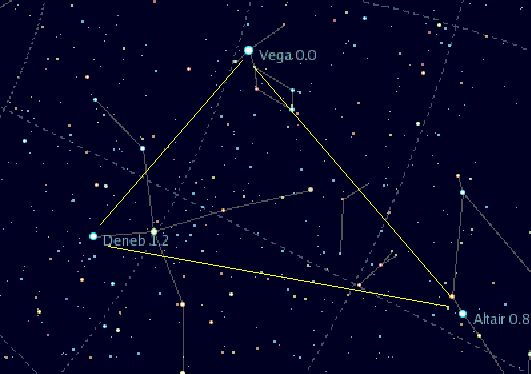

# hello MCIS6273
***
lots of **different** formatting options  
To add *emphasis* and be dramatic  
> I can make block quotes using `>`
>> these can be nested  

~I don't want this line~  
You can make something look like code using `backticks`  

Adding websites is [easy](https://www.youtube.com/watch?v=xvFZjo5PgG0 "Something you wanna click")

You can also add pictures using `!`  
  

This is the summer triangle! Featuring:
- Vega
- Altair
- Denub
